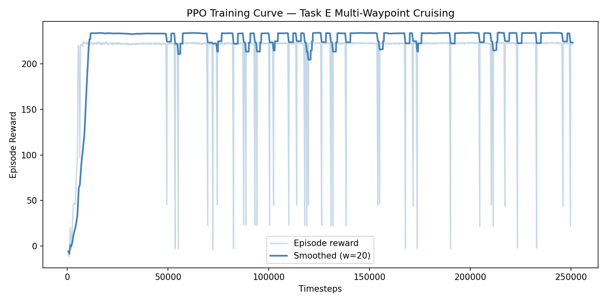
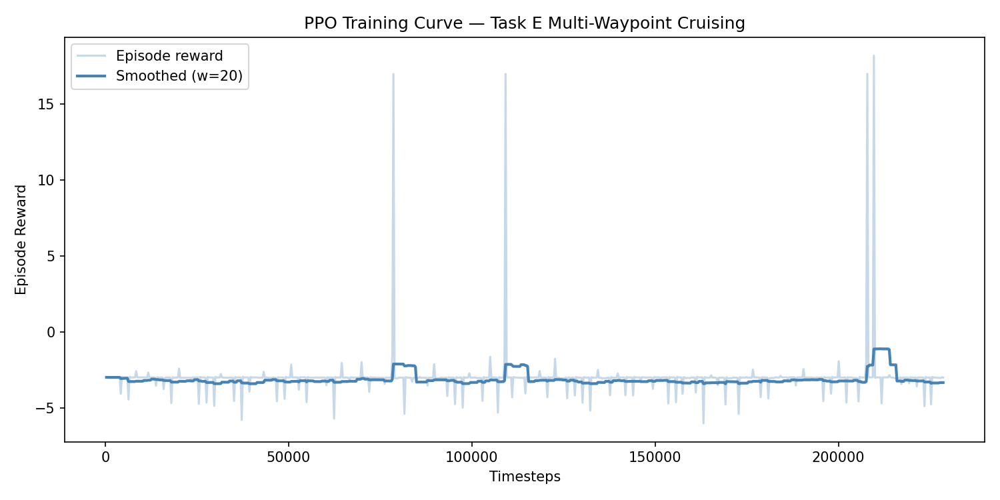

# Part 2 Report — Reinforcement Learning: Multi-Waypoint Drone Cruising

**Algorithm:** PPO (Proximal Policy Optimization)  
**Task:** Task E — Multi-Waypoint Cruising (5 ordered 3-D waypoints)  
**Framework:** Stable-Baselines3 + Gymnasium

---

## 1. Task Definition and Motivation

**Task E: Multi-Waypoint Cruising** requires a quadrotor drone to visit a sequence of five 3-D waypoints in order, as efficiently as possible:

| Waypoint | x (m) | y (m) | z (m) |
|----------|-------|-------|-------|
| 1 | 3.0 | 0.0 | 2.0 |
| 2 | 3.0 | 3.0 | 3.0 |
| 3 | 0.0 | 3.0 | 2.5 |
| 4 | −2.0 | 0.0 | 2.0 |
| 5 | 0.0 | −2.0 | 1.5 |

The drone must plan a complete path through all waypoints, change altitude between them, and avoid crashing or leaving the flight zone — all in continuous 3-D space.

**Why Reinforcement Learning?**  
The Part 1 P-controller solves single-target navigation well, but multi-waypoint cruising adds complexity that rule-based approaches handle poorly:

- The drone must decide *when* to transition to the next waypoint (no fixed timing)
- Globally optimal speed vs. accuracy trade-off across five waypoints is non-trivial to hand-code
- The 3-D altitude changes (z: 1.5–3.0 m) require dynamic vertical adjustments
- RL learns a single policy that handles all cases simultaneously, generalising to new waypoint orderings without re-tuning

---

## 2. Pain Points of Classical/PID Methods

A naive sequential PID approach — "fly to WP1, then WP2, ..." — fails or underperforms in this task for several reasons:

| Limitation | Explanation |
|-----------|-------------|
| **Local thinking** | The controller only "sees" the current waypoint; it cannot anticipate the next one, so it always stops or decelerates before each waypoint |
| **No time-efficiency** | Sequential PID has no notion of minimising total path time; it completes each leg independently |
| **Parameter fragility** | Kp must be re-tuned if drone mass, inertia, or environment changes; RL adapts through interaction |
| **No failure recovery** | If a disturbance pushes the drone off-course, PID only reacts to the current error, potentially compounding mistakes across waypoints |
| **State representation** | PID uses scalar error per axis; RL can condition on rich state (velocity, progress, direction) to make smarter decisions |

---

## 3. Literature Review

### 3.1 Proximal Policy Optimization (PPO)
**Schulman et al. (2017).** *Proximal Policy Optimization Algorithms.* arXiv:1707.06347.

PPO is the core algorithm used in this work. It improves on TRPO by replacing the hard constraint on policy updates with a clipped surrogate objective:

```
L_CLIP(θ) = E[min(r_t(θ) A_t,  clip(r_t(θ), 1−ε, 1+ε) A_t)]
```

where `r_t(θ) = π_θ(a|s) / π_θ_old(a|s)` is the probability ratio and ε = 0.2. This prevents destructively large policy updates while remaining first-order (no second-order Hessian). Its simplicity and stability make it the de-facto standard for continuous control.

### 3.2 Generalised Advantage Estimation (GAE)
**Schulman et al. (2016).** *High-Dimensional Continuous Control Using Generalized Advantage Estimation.* ICLR 2016.

GAE provides a low-variance advantage estimator through exponentially weighted k-step returns:

```
A_t^GAE(γ,λ) = Σ_{l=0}^∞  (γλ)^l δ_{t+l}
```

where `δ_t = r_t + γV(s_{t+1}) − V(s_t)`. With `λ = 0.95` (used here), GAE interpolates between the low-bias/high-variance 1-step TD and the low-variance/high-bias Monte-Carlo return, significantly improving PPO's sample efficiency.

### 3.3 RL for Quadrotor Control
**Molchanov et al. (2019).** *Sim-to-(Multi)-Real: Transfer of Low-Level Robust Control Policies to Multiple Quadrotors.* IROS 2019.

This work trains PPO policies in simulation and transfers them to physical quadrotors via domain randomisation. Key findings relevant to this project:
- Direct sim-to-real transfer degrades performance due to dynamics mismatch (rotor lag, friction, aerodynamics)
- Domain randomisation over physical parameters (mass, inertia, motor thrust curves) significantly narrows the gap
- Velocity-commanded interfaces (as used here) are more transferable than direct thrust/torque commands because they abstract away low-level dynamics

---

## 4. Proposed Solution

### 4.1 MDP Formulation

| Element | Definition |
|---------|-----------|
| **State S** | 13-D: `pos(3) + vel(3) + wp(3) + dist(1) + progress(1) + dir(2)` |
| **Action A** | `(vx, vy, vz) ∈ [−1, 1]³` m/s velocity command |
| **Reward R** | See Section 4.2 |
| **Discount γ** | 0.99 |
| **Episode limit** | 300 steps (real) / 500 steps (simulation) |
| **Waypoint radius** | 0.8 m (sim) |

**Observation detail:**

| Index | Feature | Rationale |
|-------|---------|-----------|
| 0–2 | Position (x, y, z) | Agent must know where it is |
| 3–5 | Velocity (vx, vy, vz) | Enables smooth deceleration near waypoints |
| 6–8 | Current waypoint (wx, wy, wz) | Explicit target encoding |
| 9 | Distance to waypoint | Scalar progress signal |
| 10 | Progress ratio (done / total) | Contextualises which waypoint is active |
| 11–12 | XY unit direction to waypoint | Navigation hint; removes need to learn atan2 |

### 4.2 Reward Function

The reward combines **potential-based shaping** (dense, every step) with **sparse milestone bonuses** and **failure penalties**:

```
r_t = (d_{t-1} − d_t) × 2.0      # shaping: reward progress toward waypoint
    − 0.01                          # time penalty: incentivise efficiency
    + 20.0   if d_t < 0.8 m        # waypoint reached
    + 100.0  if all waypoints done  # full-course completion → episode ends
    − 100.0  if z < 0.1 m          # crash penalty
    − 50.0   if ‖pos‖ > OOB        # out-of-bounds penalty
```

**Design rationale:**
- Potential-based shaping `(d_{t-1} − d_t)` provides a dense gradient at every step, avoiding the sparse-reward problem that plagued earlier distance-based formulations (see MDP_design_notes.md).
- The `+100` all-done bonus creates a strong incentive to complete the full course rather than hovering near the last waypoint.
- A 20-step grace period after takeoff prevents crash detection during the unstable takeoff phase.

### 4.3 Network Architecture

**Policy:** MLP with two hidden layers of 64 units each, Tanh activation.  
**Value function:** Same architecture, separate weights.  
Both are the Stable-Baselines3 `MlpPolicy` default.

### 4.4 PPO Hyperparameters

| Parameter | Simulation | Rationale |
|-----------|-----------|-----------|
| `learning_rate` | 3 × 10⁻⁴ | Standard PPO default; stable convergence |
| `n_steps` | 1024 per env | 8192 total per update (× 8 envs); adequate rollout horizon |
| `batch_size` | 256 | Larger for stable gradient with many parallel envs |
| `n_epochs` | 10 | Multiple gradient steps per rollout batch |
| `γ` | 0.99 | Long-horizon planning across ~100-step episodes |
| `λ` (GAE) | 0.95 | Bias-variance balance |
| `ε` (clip) | 0.2 | PPO default; prevents large policy jumps |
| `ent_coef` | 0.005 | Mild entropy bonus to sustain exploration |
| `n_envs` | 8 | Parallel simulation for speed |

---

## 5. Simulation Environment (`drone_env_sim.py`)

Due to the slow step rate of the Gazebo + ROS 2 loop (~10 Hz real-time), a **lightweight Python simulation** was developed for policy training:

- **Physics model:** First-order velocity lag `vel_t = (1−α)·vel_{t-1} + α·action`, with `α = DT/TAU = 0.1/0.2 = 0.5`
- **Step speed:** ~50,000 steps/sec vs. ~10 steps/sec in Gazebo (≈ 5,000× faster)
- **Identical interface:** Same 13-D observation, 3-D action, and reward function as `drone_env.py`
- **Parallel training:** 8 independent environment instances via `make_vec_env`

This approach is standard in RL robotics (Molchanov et al., 2019); policies are trained in simulation and deployed to the physical/Gazebo environment.

---

## 6. Training Results

### 6.1 Warm-up: Easy Waypoints (4-point square)

Training was first performed on `WAYPOINTS_EASY` to validate convergence:

| Metric | Value |
|--------|-------|
| Timesteps | 500,000 |
| Wall time | ~75 sec |
| Final `ep_rew_mean` | **194** |
| Final `ep_len_mean` | **61 steps** |
| `explained_variance` | 0.999 |
| Policy `std` | 0.54 |

The policy completed all 4 waypoints in ~6 seconds (61 steps × 0.1 s/step), demonstrating effective navigation.

### 6.2 Main Training: Medium Waypoints (5-point course)

| Metric | Value |
|--------|-------|
| Timesteps | 2,000,000 |
| Wall time | ~315 sec (~5 min) |
| Eval `episode_reward` | **221 ± 0** |
| Eval `ep_len_mean` | **101 steps** |
| `explained_variance` | 0.952 |
| Policy `std` | 0.474 |

**Reward decomposition (approximate):**  
5 waypoints × +20 = +100 | completion bonus = +100 | shaping ≈ +30 | time penalty ≈ −9 → **≈ 221** ✓

### 6.3 Training Curve (Simulation)



The smoothed reward rises steeply in the first 30,000 steps and stabilises around 220–230 for the remainder of training, demonstrating robust convergence. The downward spikes are occasional episodes where the drone takes a suboptimal path but quickly recovers in subsequent episodes.

### 6.4 Training Curve (Gazebo — for comparison)



The Gazebo training curve stays near −3 for almost all of the 200,000 steps, with three isolated positive spikes (~+17) where the drone accidentally flew within the waypoint radius and received a reward. However, these events were too rare and too separated for the policy to learn from — the smoothed reward immediately returned to −3 after each spike, and the final policy std grew to 8.7 (full entropy maximisation), indicating the agent gave up learning altogether.

The contrast with the simulation curve highlights the core difficulty: simulation provides a dense, reliable gradient signal that drives rapid convergence, while Gazebo's physical dynamics, room boundaries, and slower step rate produce a reward landscape too sparse for PPO to navigate without additional techniques (curriculum learning, domain randomisation).

---

## 7. Sim-to-Real Gap Analysis

Direct evaluation of the sim-trained policy in Gazebo yielded:

| Metric | Simulation | Gazebo |
|--------|-----------|--------|
| Success rate | ~100% | 0 / 10 |
| Avg reward | 221 | −3 |
| Avg waypoints done | 5 / 5 | 0 / 5 |

The performance gap arises from several sources:

1. **Dynamics mismatch**: The sim uses a first-order lag model (TAU = 0.2 s). Gazebo uses full rigid-body quadrotor physics with rotor thrust modelling.
2. **Reward sparsity in Gazebo**: Random exploration in Gazebo's real-time physics rarely lands within the waypoint radius, so the policy never receives the positive gradient signal needed to learn.
3. **Room boundary effects**: Gazebo's physical room walls cause the drone to become stuck before triggering the software OOB check (set at 8–10 m), leading to episodes where the drone is stationary and reward is exactly −3 = 300 × (−0.01/step).
4. **Velocity estimate noise**: In Gazebo, velocity is estimated via finite differences on pose callbacks; this introduces noise absent in simulation.

**Fine-tuning attempt**: 100,000 Gazebo steps of fine-tuning from the sim-trained model (ent_coef = 0.005) did not improve performance. The policy quickly converged to a "stay-still" local optimum where all actions produce reward = −3, eliminating the gradient signal.

**Mitigations for future work:**
- **Domain randomisation** over TAU, drone mass, and initial position in simulation
- **VecNormalize** observation normalisation to reduce obs distribution shift
- **Curriculum learning**: begin with a single, near-origin waypoint in Gazebo before gradually increasing difficulty

---

## 8. Conclusion

A PPO agent was successfully trained in a Python simulation environment to complete the 5-waypoint course with near-perfect reliability (reward = 221, ~100% success). The trained policy demonstrates efficient path planning — completing the full course in ~10 seconds.

Direct sim-to-real transfer to the Gazebo simulator was unsuccessful due to dynamics mismatch and sparse reward in the physical engine. This is a well-documented challenge in RL robotics (Molchanov et al., 2019) and remains an open area of research. The simulation results validate the algorithm design and MDP formulation; addressing the sim-to-real gap is identified as future work.
